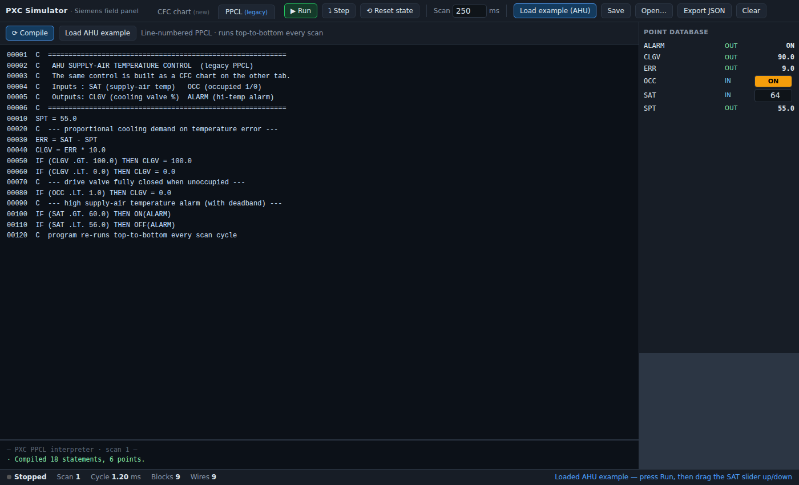

# PXC Simulator — Siemens field panel (CFC + PPCL)

A self-contained, browser-based simulator for Siemens **PXC** field panels, with **two
modes** that sit side by side so you can model the migration directly:

- **CFC chart (new)** — a **Continuous Function Chart** editor and **scan-cycle
  simulator**. The graphical block-and-wire approach (authored in Siemens **ABT Site**)
  that is **replacing PPCL** on these controllers.
- **PPCL (legacy)** — a **line-numbered PPCL interpreter** that actually runs your
  legacy APOGEE program top-to-bottom every scan, against a live point database.

Both ship with the **same AHU control example**, so you can see the old way and the new
way produce the same behaviour.

It is a single file — [`index.html`](./index.html). No build step, no server, no
dependencies. Double-click it (or open it in any modern browser) and it runs.

| CFC chart mode | PPCL mode |
|---|---|
|  |  |

---

## Why this exists — PPCL → CFC

The classic Siemens APOGEE field panels were programmed in **PPCL** (Powers Process
Control Language) — a line-numbered, text-based control language:

```ppcl
00010 IF (SAT .GT. 60) THEN GOTO 100
00020 SAT_LOOP = PID(...)
00100 COOLING = SAT_LOOP
```

On the newer **Desigo PXC / PXC-Modular** platform, that text program is replaced by a
**Continuous Function Chart**: you drop ready-made **function blocks** onto a chart,
**wire** each block's outputs to downstream inputs, and set each block's **parameters**.
The panel then **evaluates the whole chart every scan cycle**, continuously — which is
exactly what this simulator does.

| PPCL concept            | CFC equivalent (here)                          |
|-------------------------|------------------------------------------------|
| `POINT` (LAI/LAO/…)     | **AI / AO / BI / BO** point blocks             |
| numeric literal / setpt | **CONST / DCONST**                             |
| `IF .GT. / .LT.`        | **GT / LT / EQ / HYST**                         |
| `.AND. .OR.` logic      | **AND / OR / NOT / XOR / RS**                   |
| arithmetic expressions  | **ADD / SUB / MUL / DIV / MIN / MAX / ABS**     |
| `ONDELAY` / `OFFDELAY`  | **TON / TOF / PULSE**                           |
| `PID(...)` statement    | **PID** block                                   |
| line-by-line execution  | topological **scan evaluation** every cycle     |

---

## Running it

- **Just open `index.html`** in a browser. That's it.
- Or serve the folder, e.g. `npx serve cfc-simulator` / `python3 -m http.server`.

Your chart **auto-saves to the browser** (localStorage). Use **Export JSON** /
**Open…** to move charts between machines.

---

## How the simulator works

Every scan cycle (default **250 ms**, adjustable):

1. Blocks are ordered by a **topological sort** of the wiring.
2. Each block reads its inputs (from wired upstream outputs, or a default if unwired),
   runs its `compute()`, and writes its outputs.
3. **Feedback loops** are allowed — a wire that forms a cycle resolves with a
   **one-scan delay**, exactly as a real cyclic controller behaves.

Live values, boolean pin colours, and animated wires update on every scan.

### Controls

| Action | How |
|--------|-----|
| Add a block | click it in the left **palette** |
| Move a block | drag it **by its header bar** |
| Wire two blocks | drag from an **output pin** → onto an **input pin** |
| Delete a block / wire | select it, press **Delete** (or use the Inspector button) |
| Edit parameters | select a block → edit in the **Inspector** (right) |
| Drive an input | use the inline **slider** (AI/CONST) or **TRUE/FALSE** toggle (BI/DCONST) |
| Run / pause | **Run** button or **Spacebar** |
| Single scan | **Step** |
| Zero all states | **Reset state** (clears timers, PID integral, latches) |
| Pan / zoom | drag empty canvas / mouse wheel |

Wires are **type-checked**: analog (blue) pins only connect to analog pins, binary
(orange) only to binary. Each input takes **one** source (re-wiring replaces it).

---

## Block library

| Category | Blocks |
|----------|--------|
| **Points** | `AI` analog input · `AO` analog output · `BI` binary input · `BO` binary output |
| **Constants** | `CONST` (analog) · `DCONST` (digital) |
| **Logic** | `AND` `OR` `NOT` `XOR` · `RS` (reset-dominant latch) |
| **Compare** | `GT` `LT` `EQ` (with tolerance) · `HYST` (hysteresis switch) |
| **Math** | `ADD` `SUB` `MUL` `DIV` `MIN` `MAX` `ABS` · `SQRT` `LOG` `EXP` (PPCL fns) |
| **Timers** | `TON` (on-delay) · `TOF` (off-delay) · `PULSE` (TP) |
| **Control** | `PID` (with anti-windup) · `RAMP` · `LIMIT` · `SEL` (selector) |

Adding a block is data-driven — see the `DEFS` registry in `index.html`. A new block is
just an entry with `inputs`, `outputs`, `params`, and a `compute(I, P, S, dt)` function.

---

## The built-in example — AHU supply-air temperature control

Press **Load example (AHU)** (loaded by default). It implements a cooling-coil loop:

- **AI · SAT** — supply-air temperature sensor (drag the slider to simulate the duct
  heating up or cooling down).
- **PID · SAT loop** — direct-acting, so the **cooling valve opens as SAT rises** above
  the **CONST · SP 55 °F** setpoint.
- **BI · Occupied** + **SEL** — when unoccupied, the valve is forced to 0 %.
- **AO · Cooling valve** — the commanded valve position (%).
- **HYST · Hi-temp alarm** → **BO** — trips above 60 °F, clears below 56 °F.

Press **Run**, then drag the SAT slider up: watch the PID drive the cooling valve open
and the high-temp alarm trip.

---

## PPCL mode — running legacy programs

Switch to the **PPCL (legacy)** tab to run a real APOGEE PPCL program. The interpreter
mirrors how a field panel executes PPCL: the whole program runs **top-to-bottom every
scan cycle**, points are global, and `GOTO`/`GOSUB` redirect the program counter.

- **Editor (left)** — type or paste line-numbered PPCL, then **Compile**.
- **Point database (right)** — every referenced point appears automatically.
  **Inputs** (read but never written by the program) are editable — type a value or
  toggle a binary point. **Outputs** (written by the program) show their live computed
  value each scan.
- **Console (bottom)** — compile results, plus any errors or unsupported statements.

Press **Run** (or **Step**) and the program executes against the points. The built-in
example is the **same AHU loop** as the CFC chart, so the two tabs agree.

### Supported PPCL subset

| Area | Supported |
|------|-----------|
| Structure | line numbers, `C` comments, line **continuation**, `GOTO`, `GOSUB`/`RETURN` |
| Conditionals | `IF (…) THEN … [ELSE …]` (statement may be assignment / `GOTO` / `ON`/`OFF`/`SET`) |
| Assignment | `NAME = expression` |
| Commands | `ON(…)`, `OFF(…)`, `SET(value, pt…)` (with optional `@priority`, which is parsed and ignored) |
| Relational | `.EQ. .NE. .GT. .GE. .LT. .LE.` |
| Logical | `.AND. .OR. .XOR. .NAND.` |
| Arithmetic | `+ − * /`, unary `−`, parentheses, `.ROOT.` |
| Functions | `SQRT LOG EXP SIN COS TAN ATN ABS COM MIN MAX` |

**Not yet modelled** (parsed, logged as *unsupported*, and skipped so the rest of the
program still runs): the HVAC application statements — `LOOP` (PID), `DC` (duty cycle),
`SSTO`, `TOD`/`TODSET`, `PDL*`, `TABLE`, `SAMPLE`, `TIMAVG`, alarm/COV enable/disable,
priority arrays, and resident points (`TIME`, `DAY`, …). These are the natural next
additions — see the roadmap.

---

## Fidelity note

This models **standard CFC / IEC 61131-3 FBD execution semantics** and a pragmatic,
field-panel-flavoured block set. Block **names and exact parameterisation** are a clean
approximation, **not** a byte-for-byte clone of Siemens' proprietary ABT Site block
library. If you provide the official PXC/ABT block reference, the `DEFS` registry can be
extended to match exact block names, pins, and behaviour.

## Roadmap ideas

- **PPCL → CFC translator** — parse a PPCL listing and scaffold the equivalent CFC chart
  (blocks + wires), turning the two tabs into a real migration tool
- Model the PPCL HVAC application statements (`LOOP`, `DC`, `SSTO`, `TOD`, `PDL*`)
- Match exact Siemens ABT Site block names / icons from the manual
- BACnet-style point properties (priority array, COV, reliability)
- Trend chart / strip recorder for selected pins / points
- Sub-charts (compound blocks) and a block search box

## Reference

PPCL semantics follow the *APOGEE Powers Process Control Language (PPCL) User's Manual*,
Siemens Building Technologies document **125-1896 Rev. 5**.
