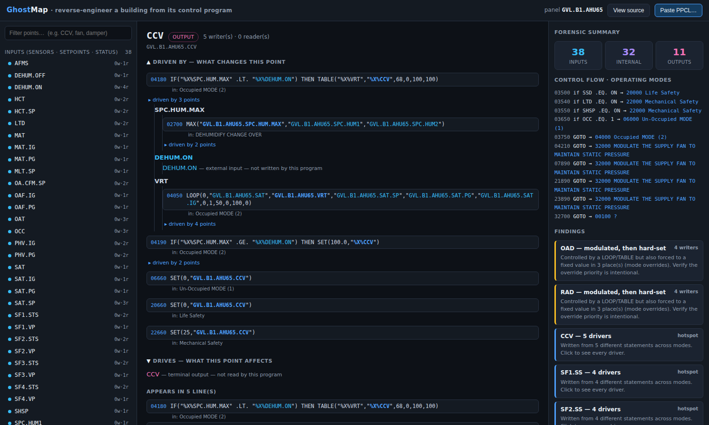

# GhostMap

**Reverse-engineer any building someone else programmed.** Drop in a field panel's
control program and GhostMap gives you a clickable causal map of *what drives what* — plus
the overrides, hotspots, and gaps nobody documented.

It is a single file — [`index.html`](./index.html). No build step, no server, no
dependencies. Open it in a browser and it runs, pre-loaded with a real Siemens PXC panel.



---

## The problem it kills

Reverse-engineering an inherited building is the most dreaded, most repeated, money-bleeding
task in controls. The real logic lives only inside the panel's program — walls of
line-numbered PPCL with `GOTO`s, interlocks buried hundreds of lines down, points read but
never written, overrides nobody remembers. As-builts are missing or lie.

To answer a basic question — *"what drives the cooling valve?"* or *"where does this alarm
come from and what locks out the economizer?"* — a senior tech traces the program line by
line on a legal pad. Every new person who touches the site redoes that decode from zero.

**The insight:** a control program *is source code*, and we have decades of dev tooling for
understanding inherited source — cross-reference, dependency graphs, dead-code detection,
"find all references." Nobody has transplanted that into building automation. Every BAS tool
shows you the building *now* (live values); **none answer what *causes* a point to move and
what it *affects*.** GhostMap does.

## What it does (and doesn't)

- **Read-only forensics.** It never authors or runs a single line of logic. It parses the
  program statically and builds a dependency graph.
- **Deterministic, verifiable core.** The causal map is plain parsing + graph traversal — no
  LLM, no guessing. Every claim links to the exact source line, shown on screen.
- It is **not** a controls editor/simulator, **not** a progress tracker, and **not** a live
  dashboard.

## The three things you get

1. **Point Inspector** — click any point and see:
   - **Driven by** — the full upstream causal chain (expand to walk it to the inputs)
   - **Drives** — everything downstream it affects
   - **Appears in** — every line that touches it, with the source inline
2. **Forensic findings** — auto-detected:
   - **Modulated-then-hard-set** points (a `LOOP`/`TABLE`-controlled output also forced to a
     fixed value elsewhere — i.e. mode overrides; verify the priority is intentional)
   - **Causal hotspots** (points written from many statements across modes)
   - **Unreachable / dead code** (statements no control path can reach)
   - **Commands with no status feedback** (a `.SS` commanded whose `.STS` is never checked)
3. **Control-flow / operating-mode map** — the decision tree and `GOTO` structure, so you
   see Life-Safety / Mechanical-Safety / Unoccupied / Occupied and where they converge.

## Try it

Open `index.html`. It loads real Siemens-programmed panels (switch between them with the
panel selector):

- **AHU-7** (Gainesville "Correct Patient") — the richer one: enthalpy + dry-bulb
  economizer, a psychrometric `GOSUB` subroutine, humidification, power-restart handler.
  Click **`OAE`** (outdoor-air enthalpy) and watch it trace *through the subroutine* back to
  the raw `OAT`/`OAH` sensors, and forward into the economizer logic.
- **AHU-65** (Clinical Lab) — click **`CCV`** (cooling valve): driven **5 ways across
  4 modes**; click **`MAD`**: driven by the economizer `MIN()`, drives `OAD` and `RAD`.

Use **Paste PPCL…** to drop in your own panel export. The samples live in
[`samples/`](./samples/).

### Pulling PPCL out of a panel backup

A clean `.pcl` listing is the easy case. Real panel backups are often **PXC-Modular `.P2`
database exports** — hex-encoded, record-framed binary. [`tools/extract_p2.py`](./tools/extract_p2.py)
decodes one into clean per-program `.pcl` files:

```
python3 tools/extract_p2.py PANEL.P2 samples/
```

(The AHU-7 sample and its sibling programs — `DAMPERS`, `EF101/147/148` — were extracted
from one such `.P2` with this tool.)

## How the engine works

It parses the real Siemens PPCL dialect — quoted dotted point names, `DEFINE`/`%X%` macros,
`LOCAL`/`$LOC`/`$ARG`/`SECND` locals, the `SAMPLE(n)` modifier, `IF/THEN/ELSE`,
`ON`/`OFF`/`SET`, `LOOP` (PID), `TABLE` (curves), `MAX`/`MIN`, `DBSWIT` (deadband switch),
`GOTO`, `GOSUB`/`RETURN`, `ONPWRT`, and assignments — and for each statement resolves which
points it **reads** and which it **writes** (e.g. `LOOP`'s 2nd point is the output; `TABLE`'s
2nd is the output; `MAX`/`MIN`/`DBSWIT` write their first/last argument). Two analyses worth
calling out:

- **Inter-procedural `GOSUB`** — a `GOSUB` passes points by reference into `$ARG1..$ARGn`.
  GhostMap reads each subroutine to learn which `$ARG`s it *reads* vs *writes*, then resolves
  every call site's argument **direction** — so a value computed inside a subroutine (e.g.
  enthalpy) is correctly an output of the caller, not a phantom input.
- **`ONPWRT` power-restart entry** — its target is treated as a second reachability root, so
  the power-up handler block isn't falsely flagged as dead code.

From that it builds:

- a **reads/writes graph** over points → the upstream/downstream traces and role
  classification (input / internal / output), and
- a **control-flow graph** (sequential fall-through + `GOTO`/conditional branches) → mode map
  and reachability/dead-code.

Adding another dialect or rule means extending the parser/ruleset — the graph stays
deterministic and verifiable.

## Status & roadmap

This is the v1 "wow" — paste a real panel, get the causal map + flags, all from a static text
file. Natural next steps:

- Persist parsed buildings per project (Postgres) as a searchable system-of-record
- LLM-drafted, human-edited **as-built sequence narrative** (clearly labeled, never
  authoritative — the graph carries trust, the prose is upside)
- More PPCL dialects / firmware vintages, and BACnet/point-list enrichment
- Cross-equipment and campus-wide views; diff two program versions
